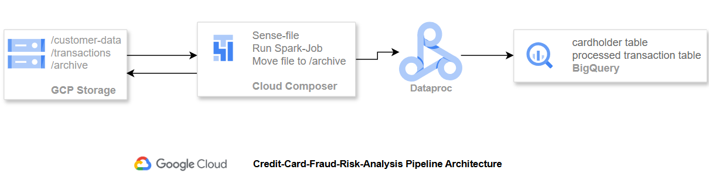
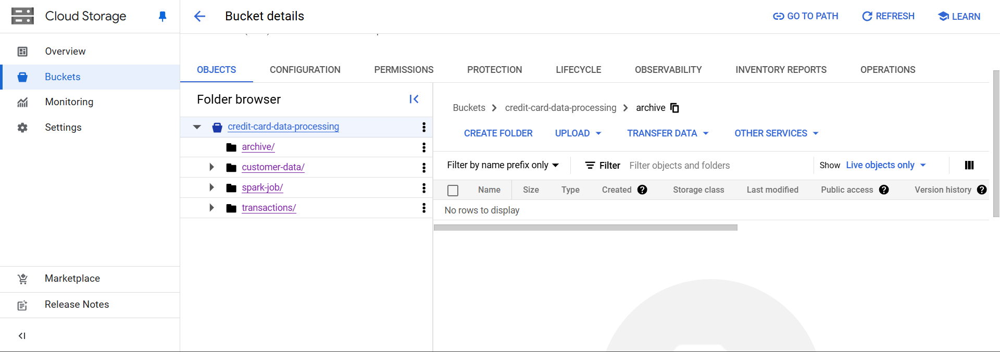
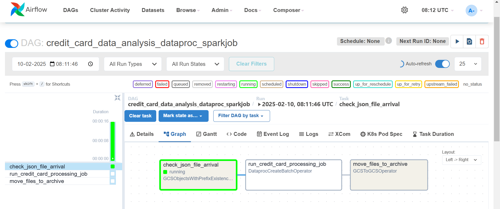
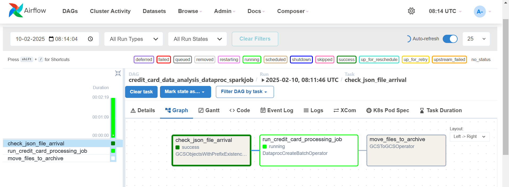
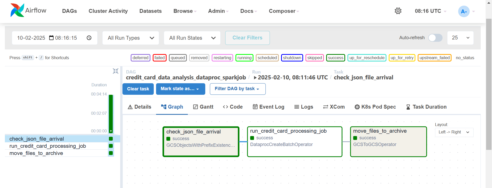
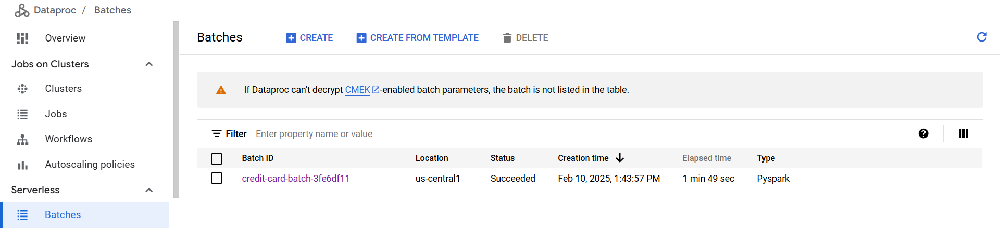
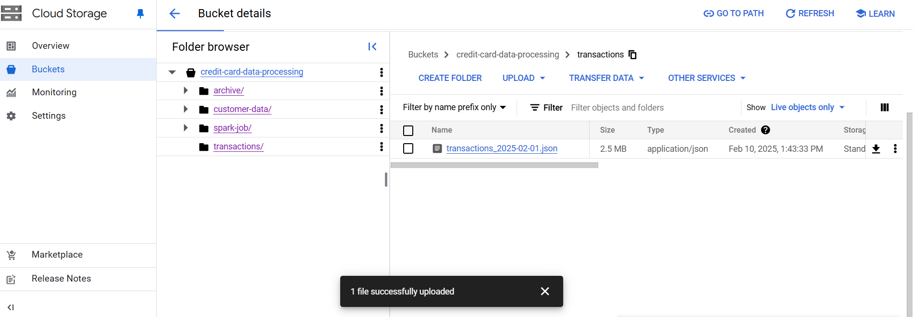
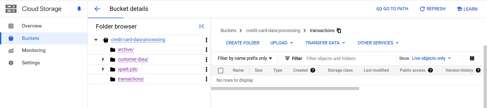
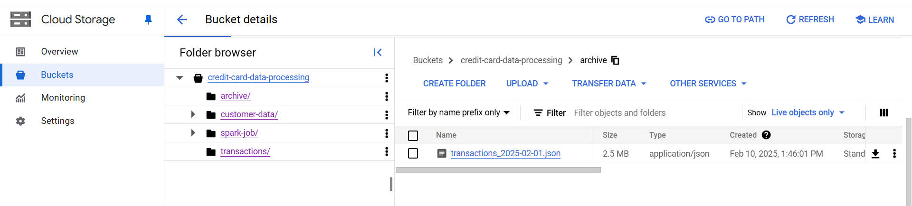
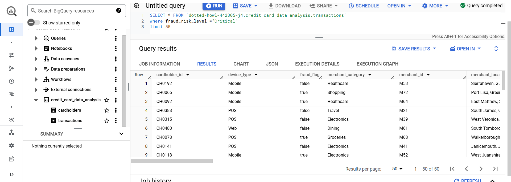

## Credit Card Fraud Risk Analysis Pipeline

## Project Overview
This project focuses on processing daily credit card transactions to detect potential fraudulent activities. The pipeline is built using Apache Airflow (GCP Composer) to orchestrate data ingestion, transformation, and storage using GCP Dataproc 
Serverless and BigQuery.

`Tech Stack:` 
- Python
- PySpark
- Google Cloud Storage (GCS)
- GCP Dataproc Serverless
- GCP BigQuery
- GCP Composer (Airflow)

## Architecture

`1️. Data Ingestion`
A static table of cardholders created in BigQuery using the `customer-data`
Daily transaction files are uploaded to a GCS bucket in `/transactions folder`.

`2️. Orchestration with Airflow`
The FileSensor Operator detects new files in the `transactions folder`.
Once a new file is available, Airflow triggers a Dataproc Serverless job.

`3️. Processing with PySpark`
The PySpark job is executed on the dataproc serverless, which performs data quality and completeness checks, transformations and data enrichment by joining the transformed transactions data with the cardholder data.
Fraud risk is analyzed based on predefined rules.
The processed data is stored in BigQuery.

`4️. Archiving`
Once processed, the transaction file is moved to an `archive` folder in GCS.

## Execution Steps:

## 1. GCS Bucket Structure

*Description:* This screenshot shows the folder structure in the GCS bucket, including the `Transactions`, `Customer-data`, `Spark-Job` and `Archive` folders. Customer-data folder contains details of all the cardholders. Transaction Folder will manage the daily transaction files arrival.

## 2. Airflow DAG Graph in GCP Composer

*Description:* These images depict the DAG graph in GCP Composer. 
- First Task: It illustrates how the File Sensor monitors the `Transactions` folder and triggers the subsequent tasks only when a new file is detected.
- Second Task: Dataproc Serverless Job: This task is triggered by the File Sensor. It submits a job to Dataproc Serverless to execute the data processing logic.
- Third task: File Mover:This task runs after the Dataproc Serverless job completes successfully.
It moves the processed file from the source directory to an archive directory.

## 3. Dataproc Serverless Job

*Description:* This screenshot shows the Dataproc Serverless job. It confirms that the PySpark job ran successfully.

## 4. File transfer Job

`File arrival`

`File Moved from source` - No file present in transactions

`File placed in archive`

*Description:* These images illustrate the arrival of source file in the target location `Transactions` and after the processing the data, the file is moved to the `archive` Folder.

## 4. Processed Data in BigQuery

*Description:* This screenshot presents the final processed data in BigQuery. It demonstrates that the pipeline successfully ingested, transformed, and loaded the transaction data for further analysis.

## Key Learnings
- Event-driven processing with Airflow: Used File Sensors to trigger DAGs dynamically, improving automation and efficiency.
- Scalable data transformation: Leveraged PySpark on Dataproc Serverless to handle large transaction datasets efficiently.
- Cloud-native ETL pipeline design: Built a cost-effective, scalable ETL pipeline optimized for fraud detection on GCP.

## Future Enhancements
- Implement real-time streaming with Pub/Sub or Kafka.
- Automate CI/CD using GitHub Actions for DAG and Spark job deployment.
- Integrate the use of environment variables in Airflow.

## 👨‍💻 Author
Hi, I’m Aman Saxena!, an aspiring Data Engineer. Feel free to connect on amansaxena129@gmail.com
