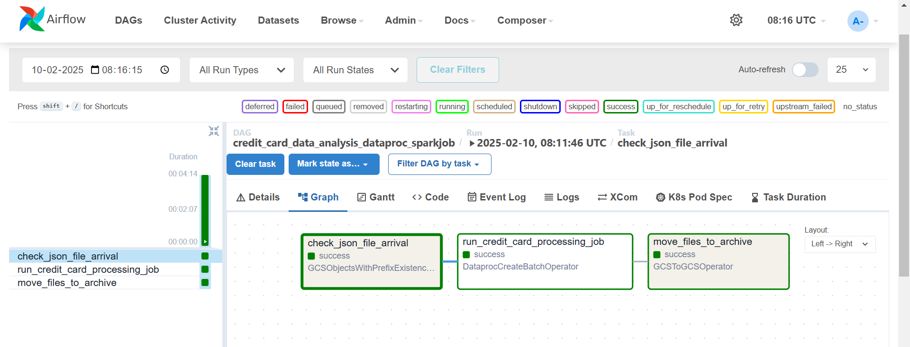
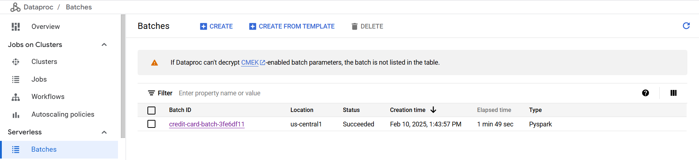
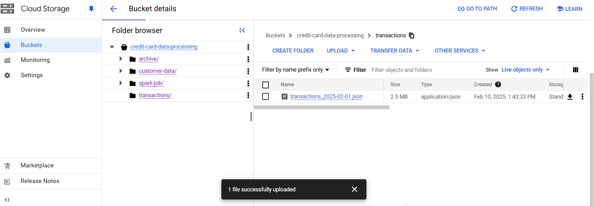
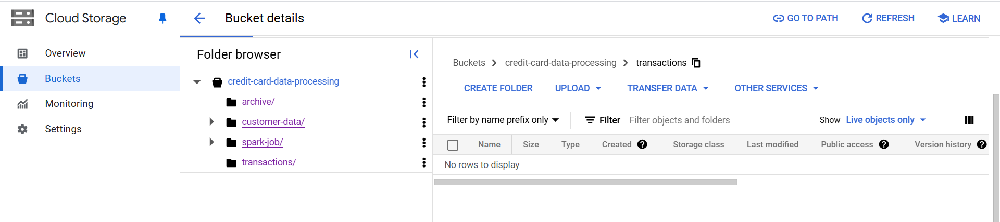
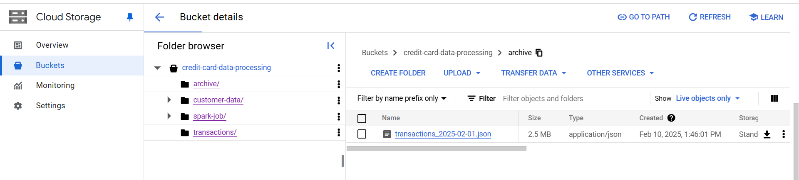

This document provides a visual overview of the Credit Card Fraud Risk Analysis Pipeline, detailing each component of the end-to-end data flow on GCP.

## 1. GCS Bucket Structure

*Description:* This screenshot shows the folder structure in the GCS bucket, including the `Transactions`, `Customer-data`, `Spark-Job` and `Archive` folders. Customer-data folder contains details of all the cardholders. Transaction Folder will manage the daily transaction files arrival.

## 2. Airflow DAG Graph in GCP Composer

*Description:* These images depict the DAG graph in GCP Composer. 
First Task- It illustrates how the File Sensor monitors the `Transactions` folder and triggers the subsequent tasks only when a new file is detected.
Second Task- Dataproc Serverless Job: This task is triggered by the File Sensor. It submits a job to Dataproc Serverless to execute the data processing logic.
Thrid task- File Mover:This task runs after the Dataproc Serverless job completes successfully.
It moves the processed file from the source directory to an archive directory.

## 3. Dataproc Serverless Job

*Description:* This screenshot shows the Dataproc Serverless job. It confirms that the PySpark job ran successfully.

## 4. File transfer Job

`File arrival`

`File Moved from source` - No file present in transactions

`File placed in archive`

*Description:* These images illustrate the arrival of source file in the target location `Transactions` and after the processing the data, it is moved to the `archive` Folder.

## 4. Processed Data in BigQuery

*Description:* This screenshot presents the final processed data in BigQuery. It demonstrates that the pipeline successfully ingested, transformed, and loaded the transaction data for further analysis.
